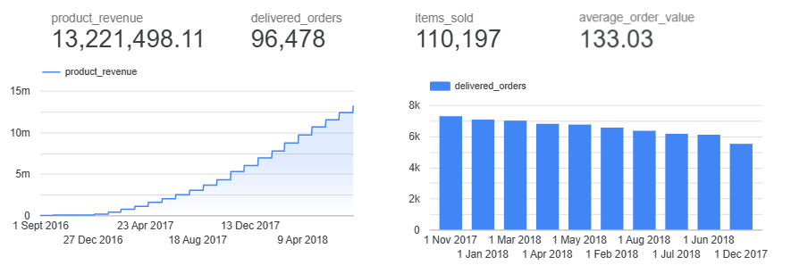
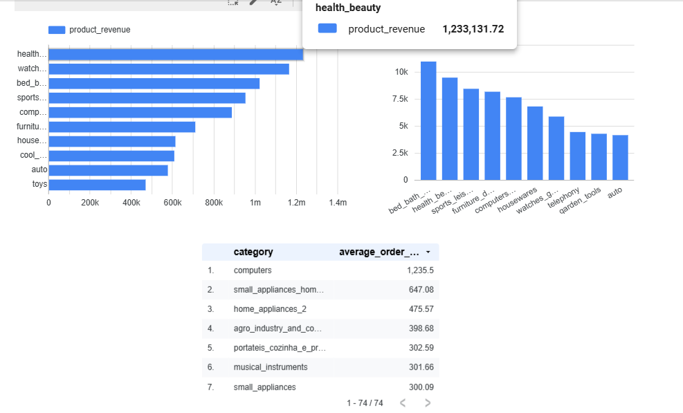
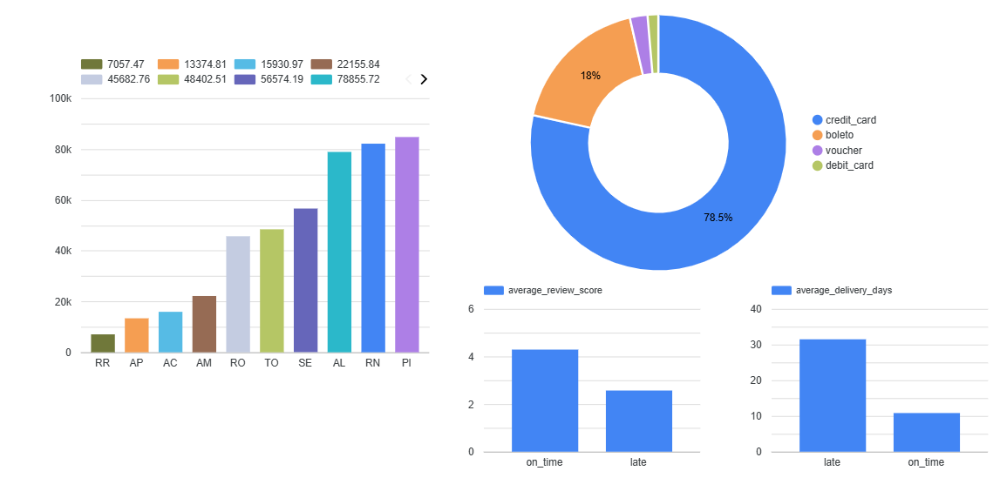

# CommerceFlow - Commerce Data Platform

CommerceFlow is a modern data engineering project that builds an end-to-end e-commerce analytics platform using Google Cloud Platform, BigQuery, dbt, Terraform and Airflow.

The project uses real-world e-commerce data, loads it into BigQuery, transforms it into analytics-ready marts with dbt, validates data quality with dbt tests, orchestrates the transformation workflow with Airflow, and prepares the final models for business intelligence dashboards.

> Learning note: this project was built while studying modern data engineering concepts, with inspiration from the [Data Engineering Zoomcamp by DataTalksClub](https://github.com/DataTalksClub/data-engineering-zoomcamp). The implementation, architecture and business case were adapted into a custom e-commerce analytics platform.

---

## Architecture

<p align="center">
  
</p>

---

## Dashboards

### Executive Overview



### Sales Performance



### Regional, Payments & Delivery



## Project Overview

E-commerce companies generate data across orders, customers, products, payments, sellers, reviews and delivery operations.

The goal of this project is to transform raw transactional data into analytical models that answer business questions such as:

- Which product categories generate the most revenue?
- How does revenue evolve over time?
- Which regions perform best?
- What is the repeat customer rate?
- Which payment methods generate the most value?
- Are late deliveries associated with lower review scores?
- Which sellers generate the most revenue?

---

##Stack

| Layer | Technology |
|---|---|
| Cloud Platform | Google Cloud Platform |
| Raw Storage | Google Cloud Storage |
| Data Warehouse | BigQuery |
| Data Transformation | dbt |
| Orchestration | Apache Airflow via Docker |
| Infrastructure as Code | Terraform |
| Language | SQL, Python |
| BI / Dashboard | Looker Studio |
| Version Control | Git/GitHub |

---

## Data Source

This project uses the **Olist Brazilian E-Commerce Public Dataset** (https://www.kaggle.com/datasets/olistbr/brazilian-ecommerce), a real-world anonymized e-commerce dataset containing information about:

- orders
- customers
- products
- order items
- payments
- sellers
- reviews
- geolocation
- product category translations

The raw CSV files are not stored in this repository.

---
## dbt Documentation

The project includes dbt models, sources and tests.

To generate the dbt documentation locally, run:

```bash
dbt docs generate --project-dir dbt --profiles-dir .
