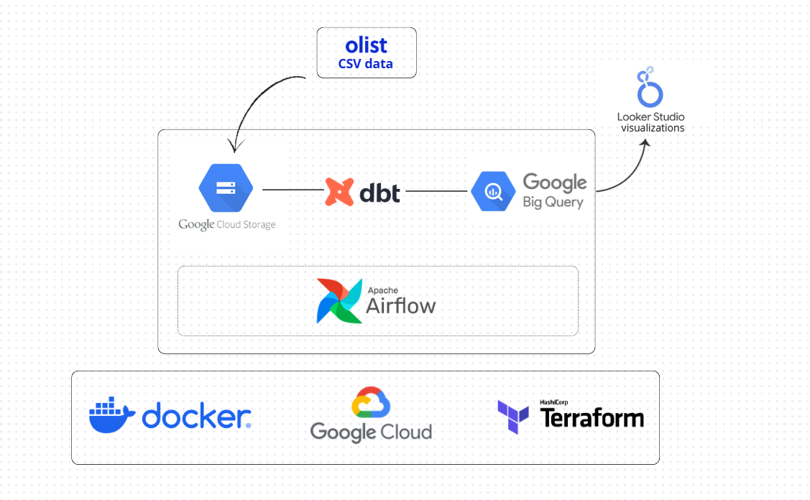

# CommerceFlow - Commerce Data Platform

CommerceFlow is a modern data engineering project that builds an end-to-end e-commerce analytics platform using Google Cloud Platform, BigQuery, dbt, Terraform and Airflow.

The project uses real-world e-commerce data, loads it into BigQuery, transforms it into analytics-ready marts with dbt, validates data quality with dbt tests, orchestrates the transformation workflow with Airflow, and prepares the final models for business intelligence dashboards.

---

## Architecture



---

## Dashboard Preview

### Executive Overview


### Sales Performance


### Regional and Payment Performance


---

## Project Overview

E-commerce companies generate data across orders, customers, products, payments, sellers, reviews and delivery operations.

The goal of this project is to transform raw transactional data into analytical models that answer business questions such as:

- Which product categories generate the most revenue?
- How does revenue evolve over time?
- Which regions perform best?
- What is the repeat customer rate?
- Which payment methods generate the most value?
- Are late deliveries associated with lower review scores?
- Which sellers generate the most revenue?

---

##Stack

| Layer | Technology |
|---|---|
| Cloud Platform | Google Cloud Platform |
| Raw Storage | Google Cloud Storage |
| Data Warehouse | BigQuery |
| Data Transformation | dbt |
| Orchestration | Apache Airflow via Docker |
| Infrastructure as Code | Terraform |
| Language | SQL, Python |
| BI / Dashboard | Looker Studio |
| Version Control | Git/GitHub |

---

## Data Source

This project uses the **Olist Brazilian E-Commerce Public Dataset**, a real-world anonymized e-commerce dataset containing information about:

- orders
- customers
- products
- order items
- payments
- sellers
- reviews
- geolocation
- product category translations

The raw CSV files are not stored in this repository.

---

## Cloud Data Pipeline

The cloud pipeline follows this flow:

```text
Olist CSV files
      ↓
Google Cloud Storage
      ↓
BigQuery raw dataset
      ↓
dbt sources
      ↓
dbt staging models
      ↓
dbt intermediate model
      ↓
dbt analytics marts
      ↓
Looker Studio dashboards
